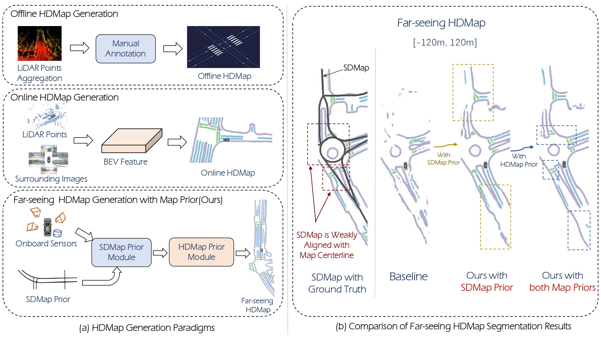

<div align="center">
<h1>P-MapNet: Far-seeing Map Generator Enhanced by both SDMap and HDMap Priors </h1>
  
[[RAL](https://ieeexplore.ieee.org/document/10643284)]   [[Paper](https://arxiv.org/pdf/2403.10521.pdf)]   [[Project Page](https://jike5.github.io/P-MapNet/)]

</div >


**Abstract:**
Autonomous vehicles are gradually entering city roads today, with the help of high-definition maps (HDMaps). However, the reliance on HDMaps prevents autonomous vehicles from stepping into regions without this expensive digital infrastructure. This fact drives many researchers to study online HDMap construction algorithms, but the performance of these algorithms at far regions is still unsatisfying. We present P-MapNet, in which the letter P highlights the fact that we focus on incorporating map priors to improve model performance. Specifically, we exploit priors in both SDMap and HDMap. On one hand, we extract weakly aligned SDMap from OpenStreetMap, and encode it as an additional conditioning branch. Despite the misalignment challenge, our attention-based architecture adaptively attends to relevant SDMap skeletons and significantly improves performance. On the other hand, we exploit a masked autoencoder to capture the prior distribution of HDMap, which can serve as a refinement module to mitigate occlusions and artifacts. We benchmark on the nuScenes and Argoverse2 datasets.
Through comprehensive experiments, we show that: (1) our SDMap prior can improve online map construction performance, using both rasterized (by up to +18.73 mIoU) and vectorized (by up to +8.50 mAP) output representations. (2) our HDMap prior can improve map perceptual metrics by up to 6.34%. (3)
P-MapNet can be switched into different inference modes that covers different regions of the accuracy-efficiency trade-off landscape. (4) P-MapNet is a far-seeing solution that brings larger improvements on longer ranges. 

## Model

### Results on nuScenes-val set
We provide results on nuScenes-val set.

|    Range    |  Method   |  M  |   Div.   |   Ped.   |  Bound.  |   mIoU    |   Model    |   Config    |
|:-----------:|:--------:|:---:|:---:|:---:|:-----:|:--------:|:--------:|:--------:|
|  60 × 30 | HDMapNet | L+C | 45.9 | 30.5 | 56.8 | 44.40 | [ckpt](https://drive.google.com/file/d/1yYCRk_as7Vhvi_rL5BxqVrmEf_u7mB3b/view?usp=drive_link) | [cfg](config/nusc/baseline/baseline_60m.py) | 
|  60 × 30 | P-MapNet(SD+HD Prio.) | L+C | **54.2** | **41.3** | **63.7** | **53.07** | [ckpt](https://drive.google.com/file/d/1hr9QNRDOWmiqZcW2L5WY_o_0aIZFIo0W/view?usp=drive_link) | [cfg](config/nusc/hd_prior/hd_60m.py) | 
|  120 × 60 | HDMapNet | L+C | 53.6   |   37.8   |   57.1   |   49.50 | [ckpt](https://drive.google.com/file/d/1L_3whc53FmEdGh8Fn1EVS7xquX0_xHZJ/view?usp=drive_link) | [cfg](config/nusc/baseline/baseline_120m.py) | 
|  120 × 60 | P-MapNet(SD+HD Prio.) | L+C | **65.3** | **52.0** | **68.0** | **61.77** | [ckpt](https://drive.google.com/file/d/1MG10vfqFDnf4sYiDqdO2274LlQB670ne/view?usp=drive_link) | [cfg](config/nusc/hd_prior/hd_120m.py) | 
|  240 × 60 | HDMapNet | L+C | 40.0   |   26.8   |   42.6   |   36.47 | [ckpt](https://drive.google.com/file/d/1oKjYPXVxu0MwDzrOJ97r-0b2GBnKxK12/view?usp=drive_link) | [cfg](config/nusc/baseline/baseline_240m.py) | 
|  240 × 60 | P-MapNet(SD+HD Prio.) | L+C | **53.0** | **42.6** | **54.2** | **49.93** | [ckpt](https://drive.google.com/file/d/1lcA9U9oWKYM9X20gblBaG16I2DBLt2yU/view?usp=drive_link) | [cfg](config/nusc/hd_prior/hd_240m.py) | 

> The model weights under **other settings** can be downloaded at [GoogleDrive](https://drive.google.com/drive/folders/1P6LuhsHy3yy4sGwlDCGT9tjVzYpcaqEb?usp=drive_link) or [百度云](https://pan.baidu.com/s/1OVI3aWgOGGg6_iGCs_gxDg?pwd=65aa).

## Getting Started
- [Installation](docs/installation.md)
- [Train and Eval](docs/getting_started.md)
- [visualization](docs/visualization.md)


### TODO
- [ ] Add Argoverse2 dataset model

### Citation
If you found this paper or codebase useful, please cite our paper:
```
@ARTICLE{10643284,
  author={Jiang, Zhou and Zhu, Zhenxin and Li, Pengfei and Gao, Huan-ang and Yuan, Tianyuan and Shi, Yongliang and Zhao, Hang and Zhao, Hao},
  journal={IEEE Robotics and Automation Letters}, 
  title={P-MapNet: Far-Seeing Map Generator Enhanced by Both SDMap and HDMap Priors}, 
  year={2024},
  volume={9},
  number={10},
  pages={8539-8546},
  keywords={Feature extraction;Skeleton;Laser radar;Generators;Encoding;Point cloud compression;Autonomous vehicles;Computer vision for transportation;semantic scene understanding;intelligent transportation systems},
  doi={10.1109/LRA.2024.3447450}}

```
